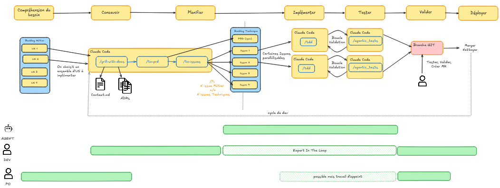
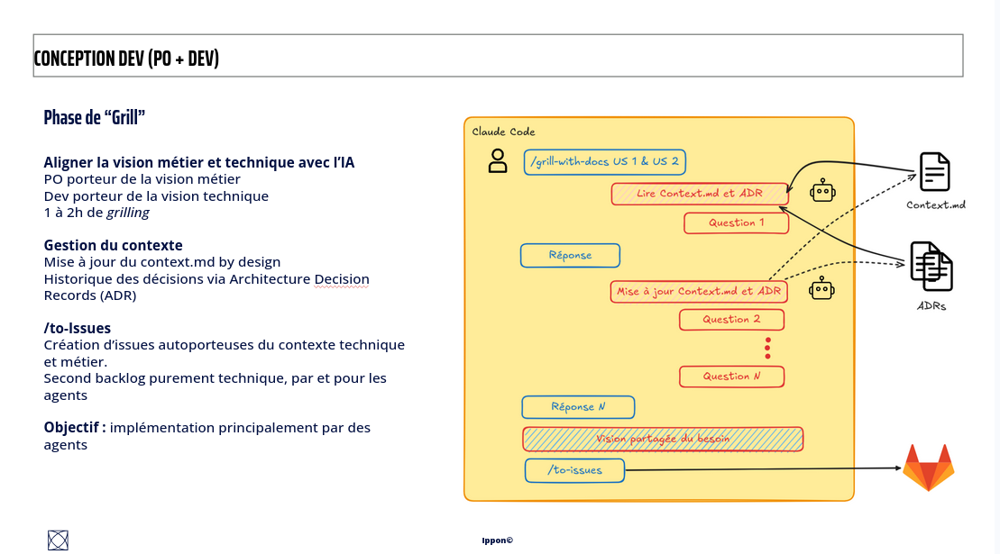
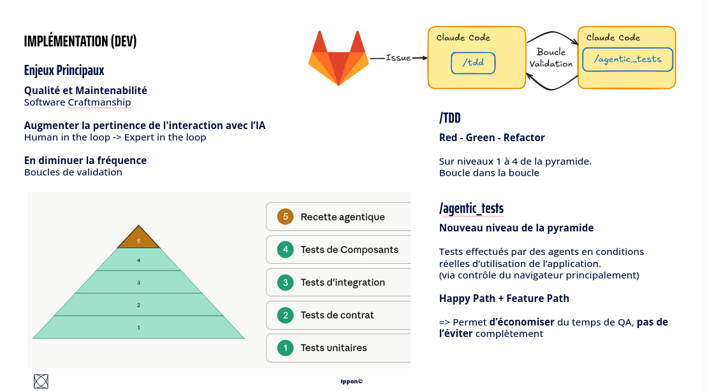
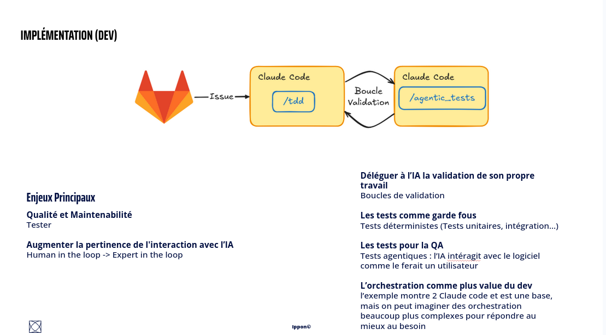

# Prompt Driven Software Factory (PDSF)



Une **usine logicielle agentique** : un process clair et un outillage précis pour chaque rôle
(humain comme agent IA), du besoin métier jusqu'au déploiement. Le cœur de l'effort humain se
concentre en **conception** ; les agents prennent en charge l'essentiel de l'implémentation,
sous supervision d'un expert.

PDSF est un jeu de **skills** Claude Code (commandes `/…`) + un skill d'amorçage
(`/build-factory`) qui adapte le tout à ton projet. On l'installe **dans ton dépôt**, on ne
forke pas celui-ci.

## Par où commencer

Deux canaux d'installation, depuis ce dépôt GitHub public.

**Canal A — `npx skills`** (copie les skills dans le `.claude/skills/` de ton projet ;
commité, partagé avec l'équipe ; recommandé pour démarrer) :

```bash
# dans ton projet (existant ou neuf) — cible Claude Code pour écrire dans .claude/skills/
npx skills add Loulen/prompt-driven-software-factory -a claude-code
```

> Garde **`-a claude-code`** : c'est ce qui **copie** les skills dans `.claude/skills/` (le
> dossier que Claude Code lit). Sans ce flag, l'outil peut cibler plusieurs agents et écrire
> dans `.agents/skills/` — invisible pour Claude Code sans un symlink
> `.claude/skills -> ../.agents/skills`.

Puis, dans le projet : **`/build-factory`**.

**Canal B — plugin Claude Code** (disponible dans tous tes projets, versionné, updatable) :

```text
/plugin marketplace add Loulen/prompt-driven-software-factory
/plugin install pdsf@prompt-driven-software-factory
```

En mode plugin, les skills sont **préfixés** : `/pdsf:build-factory`, `/pdsf:grill-with-docs`,
etc. (le canal A les laisse sans préfixe : `/build-factory`).

### Ensuite : `/build-factory`

Il te guide pas à pas : il câble les **deux backlogs** (métier et technique), le vocabulaire
de **triage** et les **docs de domaine** pour ce dépôt, scaffolde `CLAUDE.md`, `CONTEXT.md` et
`docs/adr/`, puis t'oriente vers l'étape qui porte tout le reste : la **conception** (une
session de *grilling* avec `/grill-with-docs`). `/build-factory` câble le *workflow*, jamais la
stack technique : les agents découvrent les outils de build/test au runtime.

Le skill fonctionne aussi bien sur un **projet existant** (le grilling reconstruit alors
`CONTEXT.md` et les ADR depuis le code : prévoir une demi-journée) que sur un projet
**from-scratch** (un pitch dégrossi sert à amorcer les fichiers de contexte).

## Pourquoi cette usine ?

Depuis quelque temps, les outils qui accompagnent notre développement évoluent, voire sont
remplacés. L'adoption rapide d'outils comme Vibe Kanban, puis le développement d'outillage
personnel, montre que l'éditeur seul ne suffit plus aux équipes pour réaliser leur travail.

**Vibe Kanban (VK)** a lancé les hostilités avec sa vue Kanban qui parle aux devs comme aux
POs, et permet de manager ses agents à l'échelle de la tâche, avec une granularité fine.
Associé à un MCP vers le backlog (Jira par exemple), VK offre un lien bidirectionnel entre le
backlog et la vue Kanban. Réaliser une tâche revenait à cliquer dessus, y affecter un agent,
et (si la tâche était bien décrite et le workflow agentique mature) c'était fini : la tâche
passait « en cours » dans les deux Kanbans, puis se terminait avec un commentaire pour le PO.
VK a montré que l'orchestration d'agents IA pouvait être simple et élégante.

Mais VK nous a aussi amenés à la **limite de l'orchestration manuelle** :

- **Charge mentale accrue.** Manager ses agents, changer de contexte en permanence : rendu
  simple par VK, mais l'impact sur la fatigue en fin de journée a été unanime et rédhibitoire.
- **Scope inadapté.** Une tâche écrite par un PO peut avoir un périmètre mal taillé pour une
  réalisation par IA, ou du moins par un seul agent.

**La solution : l'orchestration automatique d'agents.** On conserve **deux backlogs** : un
backlog **métier**, tel qu'on le connaît, et un backlog **technique**, alimenté et consommé
par l'IA. L'effort de réflexion humaine se concentre dans la **phase de conception**, qui fait
passer du backlog métier au backlog technique. C'est une conception détaillée, qui peut
s'étaler sur plusieurs heures selon le scope (on s'appuie beaucoup sur le grilling, voir plus
bas).

De cette conception sortent des tâches **porteuses du contexte et des décisions techniques**
nécessaires à leur réalisation. Un agent peut alors s'en occuper de façon principalement
autonome : il lit le backlog, sélectionne la tâche autosuffisante, l'implémente, la teste, et
la présente à validation finale. La plupart des interventions humaines ont été résolues en
amont, en conception. L'humain supervise en tant qu'**expert** (*expert in the loop*).

On obtient une nouvelle manière de fonctionner, qui optimise la construction de solutions
logicielles avec un process clair et un outillage précis pour chacun des rôles, humain comme
agent. C'est la genèse d'une usine logicielle agentique.

## La méthode en un schéma

Le flux (schéma en tête de page) va du besoin au déploiement :

**Comprendre le besoin -> Concevoir -> Planifier -> Implémenter -> Tester -> Valider -> Déployer**

- **Backlog métier** (US 1, 2, 3, 4) : on choisit un ensemble d'US à implémenter.
- **Conception** : `/grill-with-docs` aligne la vision, produit `Context.md` et les `ADR` ;
  `/to-prd` puis `/to-issues` découpent en **backlog technique** (PRD + issues). N issues
  métier ≠ N issues techniques.
- **Cycle de dev** : certaines issues sont parallélisables. Chaque issue passe par `/tdd`
  puis `/agentic_tests` dans une **boucle de validation**, jusqu'à la branche d'intégration.
- **Fin de cycle** : l'humain teste, valide, crée la MR, merge et nettoie.

Trois bandes de responsabilité se superposent au flux :

- **AGENT** : porte le cœur du cycle de dev (implémentation + tests).
- **DEV** : *expert in the loop* sur toute la conception et la validation.
- **PO** : amont (besoin, backlog métier) et aval (validation) ; intervention possible mais
  d'appoint pendant le dev.

## Conception : la phase de « grill »



La conception aligne **vision métier** (portée par le PO) et **vision technique** (portée par
le dev) avec l'IA. Une à deux heures de *grilling* par US, parfois une demi-journée sur un
projet existant.

- **`/grill-with-docs`** : l'agent lit `CONTEXT.md` et les ADR, puis pose des questions une à
  une, résout chaque branche de l'arbre de décision, et **met à jour `CONTEXT.md` et les ADR
  au fil de l'eau**. On en sort une **vision partagée du besoin**. `CONTEXT.md` est le
  glossaire du domaine (et rien d'autre) ; les ADR tracent les décisions structurantes.
- **`/to-issues`** : crée des **issues autoporteuses** du contexte technique et métier. C'est
  le second backlog, purement technique, **par et pour les agents**, avec pour objectif une
  implémentation principalement réalisée par des agents.

C'est l'étape qui porte tout le reste : un agent autonome ne vaut que par la qualité du
contexte qu'on lui donne. C'est pourquoi `/build-factory` insiste autant sur le grilling.

## Implémentation et tests



Une issue est implémentée dans une **boucle de validation** entre deux compétences que
l'orchestration enchaîne : produire le code, puis valider l'app réelle.

- **`/tdd`** — Red / Green / Refactor sur les **niveaux 1 à 4** de la pyramide (unitaires,
  contrat, intégration, composants). Software craftmanship : on teste pour la qualité et la
  maintenabilité, et les tests survivent aux refactors car ils décrivent le comportement, pas
  l'implémentation.
- **`/agentic-tests`** — un **nouveau niveau au sommet** de la pyramide : des tests effectués
  par des agents en conditions réelles d'utilisation (pilotage du navigateur principalement),
  *Happy Path* + *Feature Path*. Ça permet d'**économiser** du temps de QA, pas de l'éviter.



Les enjeux derrière ces choix :

- **Qualité et maintenabilité** : les tests comme garde-fous déterministes (unitaires,
  intégration…).
- **Déléguer à l'IA la validation de son propre travail** : des **boucles de validation**,
  qu'on cherche ensuite à raréfier.
- **Du *human in the loop* à l'*expert in the loop*** : on augmente la pertinence de
  l'interaction avec l'IA.
- **L'orchestration comme valeur ajoutée du dev** : l'exemple montre deux instances de Claude
  Code, mais on peut imaginer des orchestrations bien plus complexes pour répondre au besoin.

## Les skills

| Skill | Rôle dans l'usine |
| --- | --- |
| **`build-factory`** | Point d'entrée. Câble les deux backlogs, le triage et les docs de domaine ; scaffolde `CLAUDE.md` / `CONTEXT.md` / `docs/adr/` ; amorce la conception. |
| **`grill-with-docs`** | Session de *grilling* : aligne la vision, met à jour `CONTEXT.md` et les ADR au fil des décisions. |
| **`to-prd`** | Synthétise le contexte en un PRD publié sur le backlog technique. |
| **`to-issues`** | Découpe un plan/PRD en issues autoporteuses (tracer bullets), chacune avec son *Feature Path*. |
| **`triage`** | Fait passer les issues par une machine à états (`needs-triage`, `ready-for-agent`, …) ; prépare les briefs d'agent. |
| **`tdd`** | Red / Green / Refactor sur les niveaux inférieurs de la pyramide. |
| **`agentic-tests`** | Runner des tests agentiques (HP / FP) : un subagent valide l'app réelle qui tourne, UI d'abord. |
| **`git-flow`** | Modèle de branches et gates de merge (`integration/*`, auto-merge des sous-issues, merges `develop`/`main` humains). |

## Structure du dépôt

```
prompt-driven-software-factory/
├── README.md                      ← ce fichier (méthode + genèse)
├── .claude-plugin/
│   ├── marketplace.json           ← catalogue (canal plugin)
│   └── plugin.json                ← manifeste du plugin « pdsf »
├── skills/
│   ├── build-factory/             ← amorçage (+ seed-templates docs/agents)
│   ├── grill-with-docs/           ← conception (+ CONTEXT-FORMAT, ADR-FORMAT)
│   ├── to-prd/
│   ├── to-issues/
│   ├── tdd/                       ← (+ tests, mocking, refactoring, deep-modules…)
│   ├── agentic-tests/             ← (+ SCENARIO-FORMAT)
│   ├── triage/                    ← (+ AGENT-BRIEF, OUT-OF-SCOPE)
│   └── git-flow/
└── docs/assets/                   ← schémas de la méthode
```

Ce dépôt est une **source d'installation**, pas un projet à faire tourner. C'est `/build-factory`,
exécuté **dans ton projet**, qui y génère `CLAUDE.md`, `docs/agents/*.md` (config backlogs /
triage / domaine), `CONTEXT.md` et `docs/adr/`.

## Crédits

Plusieurs skills d'ingénierie (`grill-with-docs`, `to-prd`, `to-issues`, `triage`, `tdd`)
dérivent des [skills de Matt Pocock](https://github.com/mattpocock/skills), adaptés et
généralisés pour cette usine. La méthode et son outillage ont été assemblés chez **Ippon
Technologies**.
