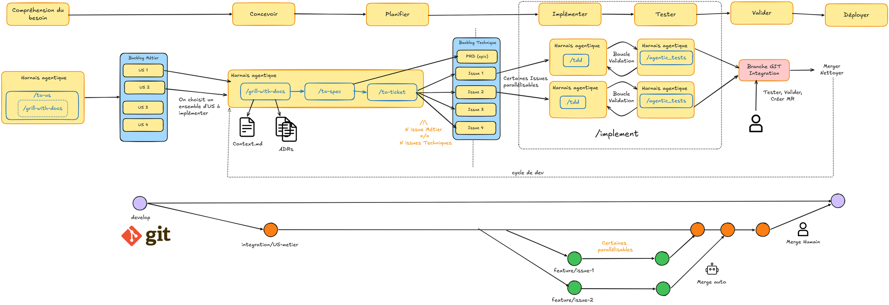
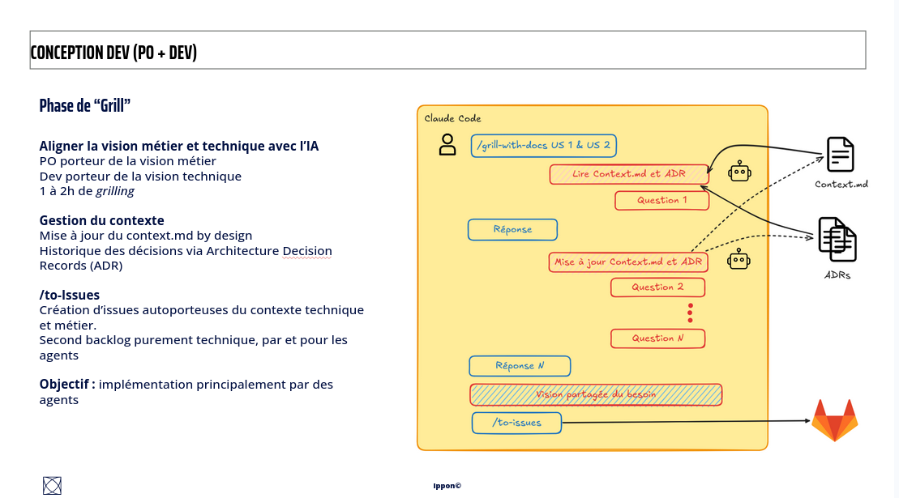
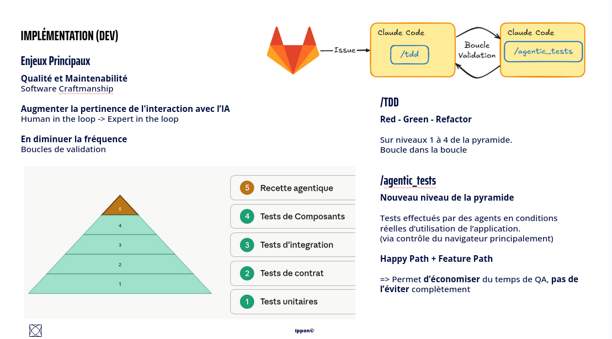
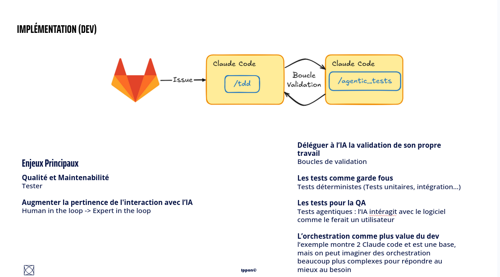

# Prompt Driven Software Factory (PDSF)



Une **usine logicielle agentique** : un process clair et un outillage précis pour chaque rôle
(humain comme agent IA), du besoin métier jusqu'au déploiement. Le cœur de l'effort humain se
concentre en **conception** ; les agents prennent en charge l'essentiel de l'implémentation,
sous supervision d'un expert.

PDSF est un jeu de **skills** (commandes `/…`) + un skill d'amorçage (`/build-factory`) qui
adapte le tout à ton projet. On l'installe **dans ton dépôt**, on ne forke pas celui-ci. Les
skills sont écrits **par capacités, pas pour un harness nommé** : ils tournent là où « slash
charge un prompt markdown en contexte » existe — Claude Code, Copilot, Cursor.

## Installation

Dans ton dépôt (existant ou neuf), une commande — puis `/build-factory` :

```sh
curl -fsSL https://raw.githubusercontent.com/Loulen/prompt-driven-software-factory/main/install.sh | sh
```

Monorepo, mode hors-ligne, plugin Claude Code, `npx` : voir **[`docs/INSTALL.md`](docs/INSTALL.md)**.

### Ensuite : `/build-factory`

`build-factory` est le point d'entrée, avec **deux modes** que le skill choisit selon l'état du
dépôt :

- **scaffold** — câble les **deux backlogs** (métier et technique), le vocabulaire de **triage**
  et les **docs de domaine**, puis pose `CLAUDE.md`, un `CONTEXT.md` vide et `docs/adr/` ;
- **context** — le bootstrap de projet : remplit le glossaire de `CONTEXT.md` et les ADR
  fondateurs (c'est le **premier grilling** du projet), en réutilisant les skills de support
  `grilling` et `domain-modeling`.

Il câble le *workflow*, jamais la stack technique : les agents découvrent les outils de
build/test au runtime. Le mode context marche aussi bien sur un **projet existant** (le grilling
reconstruit `CONTEXT.md` et les ADR depuis le code : prévoir une demi-journée) que **from-scratch**
(un pitch dégrossi amorce les fichiers de contexte).

À tout moment, **`/verify-factory`** rejoue un **health check** : sources externes joignables,
driver agentique qui se lance, labels de triage, scaffold et context présents, santé git-flow. Il
rapporte, propose de corriger ce qui manque, et signale l'étape suivante — **sans jamais bloquer**.

## Pourquoi cette usine ?

Depuis quelque temps, les outils qui accompagnent notre développement évoluent, voire sont
remplacés. L'adoption rapide d'outils comme Vibe Kanban, puis le développement d'outillage
personnel, montre que l'éditeur seul ne suffit plus aux équipes pour réaliser leur travail.

**Vibe Kanban (VK)** a lancé les hostilités avec sa vue Kanban qui parle aux devs comme aux
POs, et permet de manager ses agents à l'échelle de la tâche, avec une granularité fine.
Associé à un MCP vers le backlog (Jira par exemple), VK offre un lien bidirectionnel entre le
backlog et la vue Kanban. Réaliser une tâche revenait à cliquer dessus, y affecter un agent,
et (si la tâche était bien décrite et le workflow agentique mature) c'était fini : la tâche
passait « en cours » dans les deux Kanbans, puis se terminait avec un commentaire pour le PO.
VK a montré que l'orchestration d'agents IA pouvait être simple et élégante.

Mais VK nous a aussi amenés à la **limite de l'orchestration manuelle** :

- **Charge mentale accrue.** Manager ses agents, changer de contexte en permanence : rendu
  simple par VK, mais l'impact sur la fatigue en fin de journée a été unanime et rédhibitoire.
- **Scope inadapté.** Une tâche écrite par un PO peut avoir un périmètre mal taillé pour une
  réalisation par IA, ou du moins par un seul agent.

**La solution : l'orchestration automatique d'agents.** On conserve **deux backlogs** : un
backlog **métier**, tel qu'on le connaît, et un backlog **technique**, alimenté et consommé
par l'IA. L'effort de réflexion humaine se concentre dans la **phase de conception**, qui fait
passer du backlog métier au backlog technique. C'est une conception détaillée, qui peut
s'étaler sur plusieurs heures selon le scope (on s'appuie beaucoup sur le grilling, voir plus
bas).

De cette conception sortent des **tickets** **porteurs du contexte et des décisions techniques**
nécessaires à leur réalisation. Un agent peut alors s'en occuper de façon principalement
autonome : il lit le backlog, sélectionne le ticket autosuffisant, l'implémente, le teste, et
le présente à validation finale. La plupart des interventions humaines ont été résolues en
amont, en conception. L'humain supervise en tant qu'**expert** (*expert in the loop*).

On obtient une nouvelle manière de fonctionner, qui optimise la construction de solutions
logicielles avec un process clair et un outillage précis pour chacun des rôles, humain comme
agent. C'est la genèse d'une usine logicielle agentique.

## La méthode en un schéma

Le flux (schéma en tête de page) va du besoin au déploiement :

**Comprendre le besoin -> Concevoir -> Planifier -> Implémenter -> Tester -> Valider -> Déployer**

En commandes, la chaîne se lit :

```text
/to-us → /grill-with-docs → /to-spec → /to-tickets → /implement (/tdd + /code-review + /agentic-tests) → /git-flow
        \_________________ mise en place : /build-factory · santé : /verify-factory _________________/
```

- **Amont métier** : `/to-us` transforme une feature en **User Stories** métier prêtes à prendre
  (front PO). On choisit ensuite un ensemble d'US à implémenter.
- **Conception** : `/grill-with-docs` aligne vision métier et technique et met à jour `CONTEXT.md`
  et les ADR au fil des décisions ; `/to-spec` synthétise la **spec** sur le backlog technique,
  que `/to-tickets` découpe en **tickets** en **tranches verticales**, chacun porteur de son
  *Feature Path*. N US métier ≠ N tickets techniques.
- **Cycle de dev** : `/implement` orchestre **trois rôles** — `/tdd`, un `/code-review`
  **indépendant** et `/agentic-tests` — en boucle jusqu'à ce que build + tests + *Feature Path*
  soient au vert, sans finding bloquant. Certains tickets sont parallélisables.
- **Branches & merges** : `/git-flow` porte le modèle de branches (`integration/*`, auto-merge des
  sous-tickets sur *Feature Path* vert, merges `develop` / `main` humains).

Trois bandes de responsabilité se superposent au flux :

- **AGENT** : porte le cœur du cycle de dev (implémentation + tests).
- **DEV** : *expert in the loop* sur toute la conception et la validation.
- **PO** : amont (besoin, backlog métier via `/to-us`) et aval (validation) ; intervention
  possible mais d'appoint pendant le dev.

> **Guidé, pas verrouillé.** L'usine te garde **orienté** plutôt qu'elle n'impose son pipeline :
> consciente de la phase courante, elle signale toujours l'étape suivante, sans jamais bloquer. Le
> chemin conforme est rendu **évident**, jamais **obligatoire** (ADR-0001).

## Conception : la phase de « grill »



La conception aligne **vision métier** (portée par le PO) et **vision technique** (portée par
le dev) avec l'IA. Une à deux heures de *grilling* par US, parfois une demi-journée sur un
projet existant.

- **`/grill-with-docs`** : l'agent lit `CONTEXT.md` et les ADR, puis pose des questions une à
  une, résout chaque branche de l'arbre de décision, et **met à jour `CONTEXT.md` et les ADR
  au fil de l'eau**. On en sort une **vision partagée du besoin**. `CONTEXT.md` est le
  glossaire du domaine (et rien d'autre) ; les ADR tracent les décisions structurantes. Les
  sessions de grilling — celle-ci et le mode context de `/build-factory` — sont les **seules à
  écrire** `CONTEXT.md` et les ADR.
- **`/to-spec`** puis **`/to-tickets`** : la spec synthétisée est découpée en **tickets
  autoporteurs** du contexte technique et métier. C'est le second backlog, purement technique,
  **par et pour les agents**, avec pour objectif une implémentation principalement réalisée par
  des agents.

C'est l'étape qui porte tout le reste : un agent autonome ne vaut que par la qualité du
contexte qu'on lui donne. C'est pourquoi `/build-factory` insiste autant sur le grilling.

## Implémentation et tests



Un ticket est implémenté par `/implement`, qui enchaîne **trois rôles** dans une **boucle de
validation** jusqu'au vert :

- **`/tdd`** — Red / Green aux seams convenus, sur les **niveaux 1 à 4** de la pyramide (unitaires,
  contrat, intégration, composants) ; le refactoring relève de l'étape de revue, pas de la boucle
  red → green. Software craftmanship : on teste pour la qualité et la maintenabilité, et les tests
  survivent aux refactors car ils décrivent le comportement, pas l'implémentation.
- **`/code-review`** — un relecteur **indépendant**, à deux axes : **Standards** (le code
  respecte-t-il les règles documentées du repo ?) et **Spec** (fait-il ce que le ticket
  demandait ?).
- **`/agentic-tests`** — un **nouveau niveau au sommet** de la pyramide : un subagent pilote le
  **système réel qui tourne** par sa **surface primaire** (UI, CLI via tmux, ou warehouse pour
  un pipeline data), la couche **QA au-dessus des tests end-to-end**. Il joue le *Feature Path*
  (par défaut) ou les *Happy Paths*. Ça permet d'**économiser** du temps de QA, pas de l'éviter.

La boucle tourne jusqu'à ce que **build + tests + Feature Path** soient au vert, sans finding
bloquant. Là où les subagents ne sont pas disponibles, `/implement` dégrade en séquentiel
(`/tdd → /code-review → /agentic-tests`).



Les enjeux derrière ces choix :

- **Qualité et maintenabilité** : les tests comme garde-fous déterministes (unitaires,
  intégration…).
- **Déléguer à l'IA la validation de son propre travail** : des **boucles de validation**,
  qu'on cherche ensuite à raréfier.
- **Du *human in the loop* à l'*expert in the loop*** : on augmente la pertinence de
  l'interaction avec l'IA.
- **L'orchestration comme valeur ajoutée du dev** : l'exemple montre deux instances de Claude
  Code, mais on peut imaginer des orchestrations bien plus complexes pour répondre au besoin.

## Les skills

**Commandes du pipeline** (invoquées par l'humain, `/…`) :

| Skill | Rôle dans l'usine |
| --- | --- |
| **`to-us`** | Front PO. Transforme une feature en **User Stories** métier via un grilling de PO senior, puis publie après revue humaine. En amont de la conception. |
| **`grill-with-docs`** | Grilling **par US** : confronte le plan au modèle de domaine, affine le vocabulaire, écrit `CONTEXT.md` / ADR au fil des décisions. |
| **`to-spec`** | Synthétise la conversation en une **spec** publiée sur le backlog technique (pas d'interview, juste synthèse). |
| **`to-tickets`** | Découpe la spec en **tickets** en tranches verticales, chacun déclarant ses arêtes bloquantes et son *Feature Path*. |
| **`implement`** | Orchestre `/tdd`, un `/code-review` indépendant et `/agentic-tests` en boucle jusqu'au vert (build + tests + *Feature Path*), sans finding bloquant. |
| **`triage`** | Fait passer issues (et PR externes) par une machine à états ; rédige les briefs d'agent. |
| **`clean-context`** | Refacto ponctuel : purge le contexte accumulé (`CONTEXT.md`, ADR, commentaires de code) selon la règle du **contrefactuel nommé** ; supprime et resserre, n'ajoute jamais ; branche + PR dédiées (ADR-0005). |

**Commandes de setup / santé** (invoquées par l'humain) :

| Skill | Rôle dans l'usine |
| --- | --- |
| **`build-factory`** | Point d'entrée. Deux modes — **scaffold** (câble backlogs, triage, domaine ; pose `CLAUDE.md` / `CONTEXT.md` / `docs/adr/`) et **context** (bootstrap du glossaire + ADR fondateurs). Détecte l'état et propose le bon mode. |
| **`verify-factory`** | Health check re-jouable — sources externes joignables, driver agentique, scaffold/context, santé git-flow. Rapporte, propose de corriger, signale l'étape suivante ; **ne bloque jamais**. |

**Skills de support** (invoqués par les commandes, model-invoked) :

| Skill | Rôle dans l'usine |
| --- | --- |
| **`grilling`** | Le moteur de *grilling* : questionne une décision à la fois jusqu'à compréhension partagée. Réutilisé par les sessions de conception. |
| **`domain-modeling`** | Construit et affine le **modèle de domaine** quand une session écrit `CONTEXT.md`, un ADR, ou résout du vocabulaire. |
| **`code-review`** | Revue à deux axes — **Standards** et **Spec** — y compris comme relecteur indépendant dans `/implement`. |
| **`codebase-design`** | Vocabulaire partagé pour concevoir des **modules profonds** (interfaces, seams, testabilité, navigabilité). |
| **`tdd`** | Red / Green sur les niveaux bas de la pyramide, aux seams convenus (le refactoring relève de la revue). |
| **`agentic-tests`** | Pilote le **système réel qui tourne** par sa **surface primaire** (UI / CLI via tmux / warehouse), la couche QA au-dessus des tests end-to-end ; joue *Feature Path* ou *Happy Paths*. |
| **`git-flow`** | Modèle de branches et gates de merge (`integration/*`, auto-merge des sous-tickets, merges `develop` / `main` humains) ; check de position avant dev. |

## Structure du dépôt

```
prompt-driven-factory/
├── README.md                       ← ce fichier (méthode + genèse)
├── CONTEXT.md                      ← glossaire de l'usine (langage de référence)
├── docs/
│   ├── adr/                        ← décisions structurantes (ADR-0001…0005)
│   ├── agents/                     ← config backlogs / triage / domaine
│   ├── test-scenarios/             ← Happy Paths (≤ 3)
│   └── assets/                     ← schémas de la méthode
├── .claude-plugin/                 ← canal plugin (marketplace.json, plugin.json)
└── skills/
    ├── build-factory/              ← amorçage (backlogs, triage, issue-tracker-{github,gitlab,local}…)
    ├── verify-factory/             ← health check
    ├── to-us/                      ← front PO (+ US-FORMAT)
    ├── grill-with-docs/            ← conception par US (compose grilling + domain-modeling)
    ├── to-spec/                    ← synthèse de la spec
    ├── to-tickets/                 ← découpe en tickets (tranches verticales)
    ├── implement/                  ← boucle tdd + code-review + agentic-tests
    ├── triage/                     ← (+ AGENT-BRIEF, OUT-OF-SCOPE)
    ├── clean-context/              ← purge du contexte accumulé (contrefactuel nommé)
    ├── grilling/                   ← moteur de grilling
    ├── domain-modeling/            ← modèle de domaine (+ CONTEXT-FORMAT, ADR-FORMAT)
    ├── code-review/                ← revue à deux axes
    ├── codebase-design/            ← modules profonds (+ DEEPENING, DESIGN-IT-TWICE)
    ├── tdd/                        ← (+ tests, mocking)
    ├── agentic-tests/              ← (+ SCENARIO-FORMAT)
    └── git-flow/
```

Ce dépôt est une **source d'installation**, pas un projet à faire tourner. C'est `/build-factory`,
exécuté **dans ton projet**, qui y génère `CLAUDE.md`, `docs/agents/*.md` (config backlogs /
triage / domaine), `CONTEXT.md` et `docs/adr/`.

## Crédits

Plusieurs skills d'ingénierie (`grill-with-docs`, `to-spec`, `to-tickets`, `implement`,
`code-review`, `codebase-design`, `domain-modeling`, `grilling`, `triage`, `tdd`) dérivent des
[skills de Matt Pocock](https://github.com/mattpocock/skills), adaptés et généralisés pour cette
usine ; `agentic-tests` et l'orchestration de l'usine (`to-us`, `build-factory`, `verify-factory`)
lui sont propres. La méthode et son outillage ont été assemblés chez **Ippon Technologies**.
